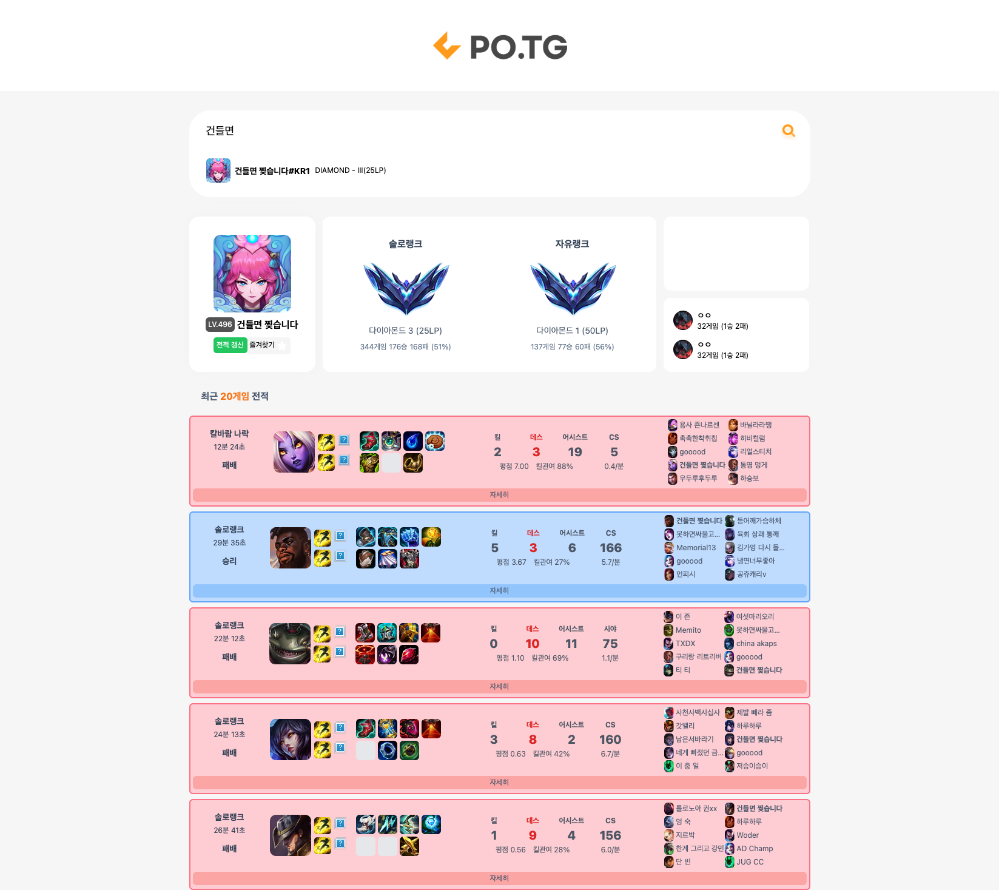

# POTG Front-end

> 위 프로젝트를 실행하기 위해서는 [potg-be](https://github.com/Team-POTG/potg-be)와 실행하여야 합니다.

### 1. 실행

```
1. npm install
2. npm run start
```

### 2. 실행화면



### 3. 주요 기술스택

```
- ReactJS
- Typescript
- GraphQL
- EmotionJS (TailwindCSS 레거시 제거 중)
- Tanstack Query (react-query)
```
